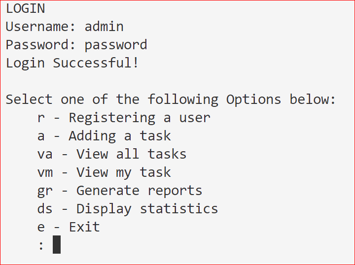

# finalCapstone
BYB 5
Task Manager
This is a Python file that monitors the status of tasks and allows the status to updated and new ones to be added. It is password protected and allows users to make and change certain records and allows admin only to make certain changes. It records certain reports to disk for later retreival.

#Contents

#Installation The file is available from <a href="https://github.com/CedricLittman/finalCapstone.git">Github</a>. Download the Python file and, provided there is a current copy of Python on the computer, it will run without any further additions.

#Objectives The task manager file was a HyperionDev bootcamp exercise and the objective was to refactor a file to make it DRYer, in other words reduce code repetition, and increase and improve its functionality. The file is written in Pytgon and, although it does include some imports, they do not require any pip installations.

#Using The File Once installed and running the user will be greeted with a login screen asking for a username and password. If the file has not been used before these are admin and password respectively. Once the user has succesfully logged in they will be freeted with a set of choices, as follows:

This is a task manager file and it gives the operator the ebility to maintain records of the following:

r - Register a user  
a - Add a task  
va - View all tasks
vm - View my task  
gr - Generate reports  
ds - Display statistics  
e - exit  

When one selects Register a user one is invited to enter a user name. If the username is already registered task manager tells the the user and prompts for another user name. Once the username has been entered the user is prompted to enter a password. One is required to enter the password twice to ensure it has been input correctly and if they are not the same the user is prompted for a new user name again.
Throughout the programme all inputs are converted to lower case to reduce errors from user input and also checked for validity. If any invalid inputs are received the function calls itself recursively and the user starts again.
The other inputs follow the same pattern and allow the records of the functions to be viewed, analysed and amended.

The file has text inputs and outputs and is used via the terminal window, in the developer's case in VS Code. Although the text presentation could have been improved with ANSI codes this was not done only because time did not allow. A typical input and output screen is shown below.

![Typical Screenshot] (New_username.PNG)

