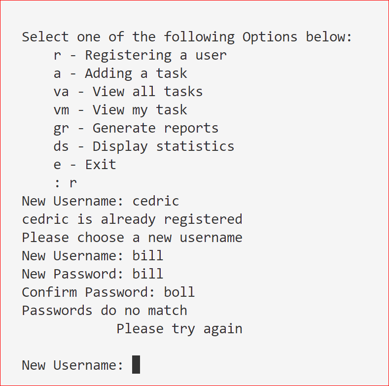

# finalCapstone
BYB 5
Task Manager
This is a Python file that monitors the status of tasks and allows the status to updated and new ones to be added. It is password protected and allows users to make and change certain records and allows admin only to make certain changes. It records certain reports to disk for later retreival.

# Contents

# Installation 
The file is available from <a href="https://github.com/CedricLittman/finalCapstone.git">Github</a>. Download the Python file and, provided there is a current copy of Python on the computer, it will run without any further additions.

# Objectives 
The task manager file was a HyperionDev bootcamp exercise and the objective was to refactor a file to make it DRYer, in other words reduce code repetition, and increase and improve its functionality. The file is written in Pytgon and, although it does include some imports, they do not require any pip installations.

# Using The File 
Once installed and running the user will be greeted with a login screen asking for a username and password. If the file has not been used before these are admin and password respectively. Once the user has succesfully logged in they will be freeted with a set of choices, as follows:

This is a task manager file and it gives the operator the ebility to maintain records of the following:

r - Register a user  
a - Add a task  
va - View all tasks
vm - View my task  
gr - Generate reports  
ds - Display statistics  
e - exit  

When one selects Register a user one is invited to enter a user name. If the username is already registered task manager tells the the user and prompts for another user name. Once the username has been entered the user is prompted to enter a password. One is required to enter the password twice to ensure it has been input correctly and if they are not the same the user is prompted for a new user name again.
Throughout the programme all inputs are converted to lower case to reduce errors from user input and also checked for validity. If any invalid inputs are received the function calls itself recursively and the user starts again.
The other inputs follow the same pattern and allow the records of the functions to be viewed, analysed and amended.

The file has text inputs and outputs and is used via the terminal window, in the developer's case in VS Code. Although the text presentation could have been improved with ANSI codes this was not done only because time did not allow. A typical input and output screen is shown below.

# Methodology
We were given a Python file which did not contain any functions making the code harder to follow and that did not effect all of the options contained in the menu. We were required to use functions to divide the various jobs the task manager effected and to reduce code repetition. We were also required to complete the code so it was able to fully effect all the options offered in the menu. The original file we were given is also available <a href="https://github.com/CedricLittman/finalCapstone/blob/main/original_task_manager%20(1).py">from this Github link</a>.

# Functions
The code was divided into functions using the following methodology.
After the user has successfully logged in initially a menu function is called which presents the user with the various jobs the programme can do. Choosing any of the options, except for ds, will itself call a function. As the function should only complete one task it would call further functions if it required information to be processed further. Some of the functions may contain some repetition of code such as reading and writing to the text files and, if this is the case, these jobs will be allocated to further functions, but time did not permit. This is definitely a modification that will be explored in future development of the file.

Some of the functions generated their own menus and two different methodologies were used to do this. One was a while true loop. The user input was checked fr validity and the user was kept being prompted for a valid input until one was received. Once a valid input was received it was passed to the conditional logic which called the appropriate function to complete the task.

The other methodology was to test the input for validity and, if the input was invalid, the function called itself recursively. Although recursive functions are not always well regarded no problems are anticipated with this use as the user is unlikely to make an invalid entry more than two or three times so the risk of a stack overflow is vanishingly small.

# Checking Input Validity
Valid inputs were restricted to simple to check ones such as a letter or two or a digit as these are very easy to check using conditional statements. In another project the programmer decided to check the validity of more complicated inputs using regular expressions but such a level of complication was not thought to be necessary for this project where simple inputs did not require any reduction in functionality.

# Reading And Writing To File
The programme read from and wrote to four different text files. One text, user.txt, file consisted on user names and passwords which was checked when the user logged in. When a new user was added thir details were added to the file.
The next, tasks.txt, contained the following information for each task:

- The user the task is assigned to
- The title of the task
- A description
- Due date for completion
- The date the task was assigned
- Whether or not the task has been completed
This file is read under various circumstances including the following. When the user wishes to see the tasks recorded by the programme and the information it contains about each one and when the user wishes to know various facts such as whether a task has been completed. It is read to control what the user can do. For example the user cannot change who the task was assigned to after it has been completed, presumably to prevent someone from taking the credit for the work of others. Before the user assigened to a task can be changed, therefore, the file is read to check if it has been completed. It is read to allow statistics to be calculated to be presented to the viewer.

It is also written to 
